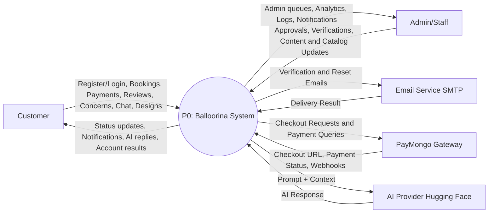
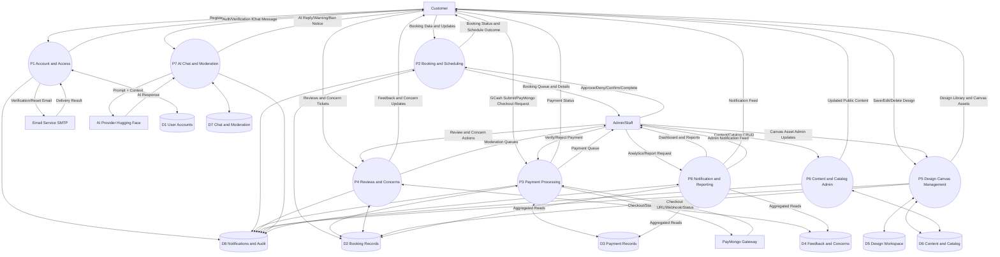

# Balloorina System Data Flow Diagram (DFD)

## Scope Used
This DFD is based on the current implemented system in this repository (`Project/app/models.py`, `Project/app/views.py`, `Project/app/urls.py`, and `Project/app/services.py`).

## System Description (Derived from Actual Code)
Balloorina is a web-based event styling platform where customers can register, verify email, log in, create bookings, upload references, save custom design canvases, submit payments (manual GCash and PayMongo checkout), send concerns, write reviews, and chat with an AI assistant. Admin/Staff users manage bookings, payments, users, reviews, concerns, site content, gallery, and design canvas assets. The system stores operational records in database models and sends/receives data through external providers (Email SMTP, PayMongo, AI provider).

---

## Context Diagram (Level 0 DFD)

### A. Text-Based Structure

#### External Entities
- `E1 Customer`
- `E2 Admin/Staff`
- `E3 Email Service (SMTP)`
- `E4 PayMongo Payment Gateway`
- `E5 AI Provider (Hugging Face Inference API)`

#### Process
- `P0 Balloorina Event Booking and Design Management System`

#### Data Flows
- `E1 -> P0`: registration data, login credentials, booking details, design canvas data, payment details, review data, concern tickets, chat messages
- `P0 -> E1`: account verification status, booking status updates, payment status, notifications, saved design records, chat responses
- `E2 -> P0`: booking decisions, payment verification/rejection, user/content/catalog management updates, concern/review moderation actions
- `P0 -> E2`: booking/payment queues, dashboard analytics, concern/review lists, audit logs, admin notifications
- `P0 -> E3`: verification email and password reset email requests
- `E3 -> P0`: email delivery outcome (success/failure)
- `P0 -> E4`: checkout session requests, payment status retrieval, webhook verification/processing
- `E4 -> P0`: checkout URLs, payment status payloads, webhook events
- `P0 -> E5`: chat prompts with system/user context
- `E5 -> P0`: AI response content

### B. Drawable Version (Mermaid)

---

## Level 1 DFD

### A. Text-Based Structure

#### External Entities
- `E1 Customer`
- `E2 Admin/Staff`
- `E3 Email Service (SMTP)`
- `E4 PayMongo Payment Gateway`
- `E5 AI Provider (Hugging Face Inference API)`

#### Data Stores
- `D1 User Accounts` (`User`)
- `D2 Booking Records` (`Booking`, `BookingImage`, `Design`)
- `D3 Payment Records` (`Payment`, `GCashConfig`)
- `D4 Feedback and Concerns` (`Review`, `ReviewImage`, `ConcernTicket`)
- `D5 Design Workspace` (`UserDesign`, `CanvasCategory`, `CanvasLabel`, `CanvasAsset`)
- `D6 Content and Catalog` (`Package`, `AddOn`, `AdditionalOnly`, `Service`, `GalleryCategory`, `GalleryImage`, `HomeContent`, `HomeFeatureItem`, `ServiceContent`, `AboutContent`, `AboutValueItem`, `ServiceChargeConfig`)
- `D7 Chat and Moderation` (`ChatSession`, `ChatMessage`, `ChatModerationState`, `ChatModerationEvent`)
- `D8 Notifications and Audit` (`Notification`, `AdminNotification`, `AuditLog`)

#### Processes and Flows

1. `P1 Account and Access Management`
- Inputs: registration form, login credentials, forgot/reset password request (`E1`)
- Reads/Writes: `D1`, `D8`
- External: sends verification/reset emails to `E3`
- Outputs: authentication result, email verification status, login session state (`E1`)

2. `P2 Booking and Scheduling Management`
- Inputs: booking form, schedule details, reference images, booking updates/deletes (`E1`), booking approval/deny/confirm/complete actions (`E2`)
- Reads/Writes: `D2`, `D8`
- Outputs: booking decisions and schedule conflict outcomes to `E1` and `E2`, notifications written to `D8`

3. `P3 Payment Processing and Verification`
- Inputs: manual GCash payment submission (`E1`), PayMongo checkout initiation (`E1`), payment verify/reject actions (`E2`)
- Reads/Writes: `D2`, `D3`, `D8`
- External: checkout/session/status/webhook exchange with `E4`
- Outputs: payment and booking payment-status updates to `E1` and admin payment queues to `E2`

4. `P4 Reviews and Concern Ticket Handling`
- Inputs: review submission/likes/edits/deletes, concern ticket submission (`E1`), testimonial toggle and concern status updates (`E2`)
- Reads/Writes: `D2`, `D4`, `D8`
- Outputs: published feedback views for customers, moderation/work queues for admins

5. `P5 Design Canvas and User Design Management`
- Inputs: canvas JSON, thumbnail, design save/rename/delete requests, package-linked design selection (`E1`), canvas asset/category/label administration (`E2`)
- Reads/Writes: `D5`, `D6`, `D8`, and design references in `D2`
- Outputs: user design library, canvas asset feeds, booking-linked design artifacts

6. `P6 Content, Catalog, and Media Administration`
- Inputs: package/add-on/additional/service/home/about/gallery/content updates (`E2`)
- Reads/Writes: `D6`, `D8`
- Outputs: updated public-facing content and catalog data consumed by customers (`E1`)

7. `P7 AI Chat and Moderation`
- Inputs: chat messages and session requests (`E1`)
- Reads/Writes: `D7`, context reads from `D1/D2/D3/D4/D5/D6`, audit writes to `D8`
- External: sends prompts/context to `E5`, receives AI replies
- Outputs: moderated AI replies, warnings, temporary ban enforcement responses (`E1`)

8. `P8 Notification and Reporting Services`
- Inputs: system events from `P1-P7`, admin analytics/report requests (`E2`)
- Reads/Writes: `D8` and aggregated reads from `D2/D3/D4`
- Outputs: customer/admin notification feeds, dashboard analytics, exported reports

### B. Drawable Version (Mermaid)

---

## Notes for Accuracy
- Booking approval flow in code transitions `pending -> pending_payment`, then payment verification transitions booking to `confirmed`.
- Payment supports both manual GCash submission and PayMongo checkout/webhook ingestion.
- AI chat includes moderation state/events and may return warning/ban payloads without saving normal chat messages.
- Admin and Staff share many management pages, while some actions (for example concern status update endpoint) are restricted to `admin` role.
